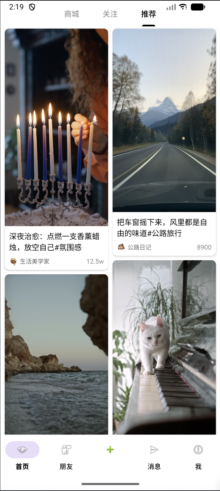
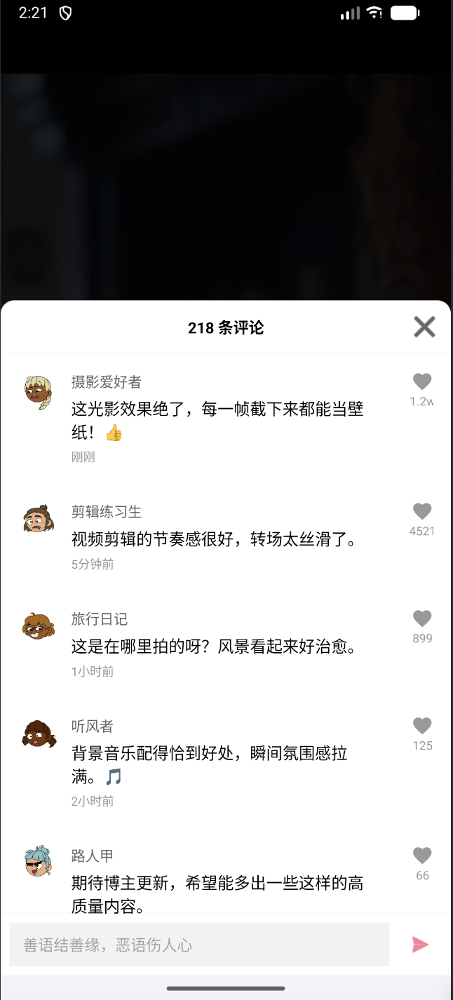

# 仿抖音推荐双列页面

一个基于 **MVVM 架构** 开发的 Android 短视频应用。项目仿照抖音 App，实现了从双列瀑布流到单列全屏播放的流畅体验，并包含了点赞、评论、下拉刷新等核心交互功能。

## 项目介绍

本项目旨在通过重构和功能迭代，实现一个高质量的短视频客户端。项目重点在于 **MVVM 架构的实践**、**视频播放体验优化**（如秒开、无黑屏）、以及**复杂 UI 交互**（如评论区弹窗、双击点赞动画）的实现。

### 核心功能

* **双列瀑布流**：首页展示双列交错排列的视频封面，支持下拉刷新和上拉加载更多。
* **沉浸式播放**：点击封面进入全屏详情页，支持上下滑动切换视频。
* **视频交互**：
    * **双击点赞**：屏幕任意位置双击出现爱心动画。
    * **评论互动**：点击评论图标从底部弹出半屏交互面板，支持发送评论并即时置顶。
    * **暂停反馈**：点击屏幕暂停/播放，并有图标反馈。
* **界面导航**：
    * 顶部 Tab 支持切换（商城、关注、推荐）。
    * 底部导航栏切换主要功能区（首页、朋友、消息、我的）。

## 技术选型

### 开发环境
* **语言**：Java
* **最低版本**：Android 8.0 (API 26)

### 架构模式
* **MVVM (Model-View-ViewModel)**
    * 使用 `LiveData` 实现数据驱动 UI，Activity 只负责视图更新。
    * `Repository` 层负责数据获取与业务逻辑，模拟网络异步请求。

### 核心组件库
* **播放器**：**Media3 (ExoPlayer)** - 高性能、可扩展的媒体播放库。
* **图片加载**：**Glide 4.15.1** - 处理封面图、头像的加载与圆角裁剪。
* **列表控件**：`RecyclerView` (StaggeredGridLayoutManager) + `SwipeRefreshLayout`。
* **分页控件**：`ViewPager2` - 实现视频详情页的翻页。
* **交互控件**：`BottomSheetDialogFragment` - 实现底部评论弹窗。

## 功能实现细节

### 1. 架构升级 (MVC -> MVVM)
* **重构前**：Activity 直接操作数据和 View，逻辑耦合严重。
* **重构后**：
    * `VideoRepository`：模拟网络延迟，通过回调接口返回数据。
    * `VideoViewModel`：持有 `LiveData`，处理分页逻辑（refresh/loadMore），不持有任何 View 引用。
    * `Activity/Fragment`：观察 `viewModel.videoList`，数据变化时自动更新 Adapter。

### 2. 双列瀑布流与分页
* **布局**：使用 `StaggeredGridLayoutManager` 实现交错布局。
* **刷新机制**：
    * **下拉刷新**：集成 `SwipeRefreshLayout`，触发 ViewModel 重置页码。
    * **上拉加载**：监听 RecyclerView 滚动状态，触底自动请求下一页数据，实现滚动体验。

### 3. 视频播放体验优化
* **ExoPlayer 封装**：使用单例模式管理 `PlayerManager`，避免资源浪费。
* **无黑屏优化**：
    * 在 PlayerView 上覆盖一张 `ImageView` 显示封面。
    * 监听播放器 `onRenderedFirstFrame` 事件，首帧渲染完毕后隐藏封面，实现视觉上的秒开。
* **生命周期**：在 `onPause`/`onDestroy` 中控制播放器的暂停与释放。

### 4. 复杂 UI 交互
* **评论区**：
    * 使用 `BottomSheetDialogFragment` 承载评论列表。
    * 实现了"本地模拟发送"：输入内容 -> 插入 Adapter 头部 -> 滚动至顶部 -> 清空输入框。
* **右侧悬浮栏**：使用 `ConstraintLayout` 实现头像、点赞、评论、分享按钮的悬浮布局。

## 难点分析与解决方案

### 难点 1：视频切换时的黑屏闪烁
**问题**：从列表进入详情页，或上下滑动切换视频时，播放器缓冲需要时间，导致出现短暂黑屏。
**解决**：采用"封面占位"策略。在 Adapter 中始终先加载封面图，利用 `Player.Listener` 监听 `onRenderedFirstFrame`，只有当视频画面真正渲染出来后，才执行动画隐藏封面图，实现无缝衔接。

### 难点 2：播放器状态管理与复用
**问题**：在 `ViewPager2` 翻页过程中，如果不加控制，会导致声音重叠或播放器挂载错乱。
**解决**：
* 在 `onPageSelected` 回调中，先暂停/解绑上一个 Item 的播放器。
* 使用 `viewPager.post()` 确保布局完成后再执行 `attachPlayerToHolder`，防止找不到 ViewHolder。
* 严格管理播放器的 `attach` 和 `detach` 逻辑。

### 难点 3：MVVM 下的数据通信
**问题**：如何在不持有 Activity引用的情况下，让 ViewModel 通知 UI 更新？
**解决**：使用 `MutableLiveData` 存储数据状态。Activity 作为观察者（Observer）订阅数据变化，实现单向数据流。

## 项目截图

  
  
  

