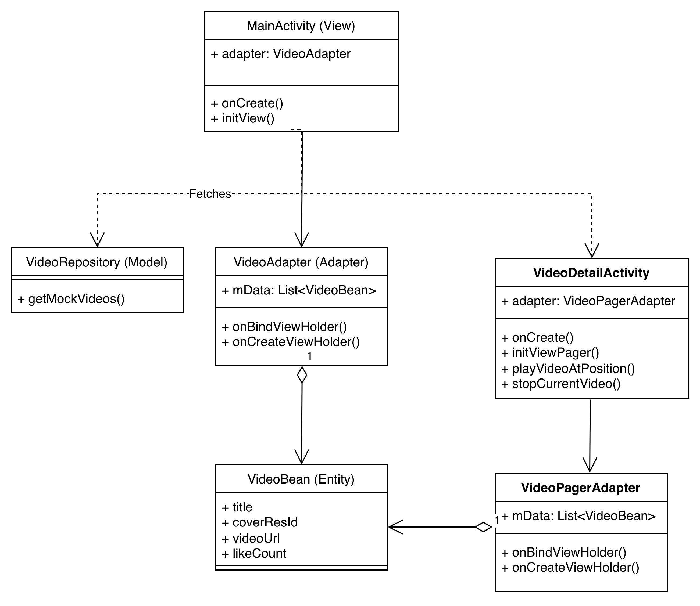

# 仿抖音推荐双列页面

一个仿照抖音 App 的 Android 客户端应用，实现了双列瀑布流视频列表、视频详情播放等核心功能。

## 项目介绍

本项目旨在仿照抖音 App，实现一个具备核心推荐功能的双列视频流应用。项目重点在于练习 Android 客户端的基础 UI 布局、列表滚动性能优化、视频播放逻辑的处理。

### 核心交付功能

**双列外流**：首页展示双列瀑布流视频封面
**视频内流**：点击封面进入详情页，支持视频播放与暂停
**上下滑动**：支持在详情页上下滑动切换视频
**页面切换**：顶部 Tab 切换（商城、关注、推荐）和底部导航切换（首页、我的）

## 技术选型

### 开发语言
- **Java**

### 架构模式
- **MVC 架构**
  - 实现 UI（Activity）与数据逻辑（Repository）的解耦
  - 使用 Repository 模式统一管理数据获取

### 核心 UI 组件
- **RecyclerView**：实现高性能的双列瀑布流列表
- **ViewPager2**：实现视频详情页的上下整页翻动效果
- **ConstraintLayout**：实现复杂的扁平化布局，减少视图层级
- **TabLayout**：顶部标签页切换
- **BottomNavigationView**：底部导航栏

### 第三方库
- **Glide 4.16.0**：高效处理图片加载、缓存和圆角裁剪
- **Material Design Components**：使用 Material 组件库

## 项目架构

## 功能实现

### 4.1 双列瀑布流

**布局管理**：
- 使用 `StaggeredGridLayoutManager`，设置 `spanCount` 为 2，实现交错排列的瀑布流效果
- 设置 `GAP_HANDLING_NONE` 策略，避免 item 之间出现空隙

**数据适配**：
- 自定义 `RecyclerView.Adapter`，在 `onBindViewHolder` 中使用 Glide 加载本地资源图片
- 支持点击事件，点击封面图进入视频详情页

**自适应高度**：
- 使用 `adjustViewBounds="true"` 和 `wrap_content` 实现图片按比例自适应高度
- Mock 数据中为不同视频设置了不同的封面图片，ItemView 根据图片比例动态计算高度

### 4.2 视频内流与播放

**页面跳转**：
- 点击首页 Item 时，通过 Intent 传递当前视频的 position
- 使用 `startActivity()` 直接跳转

**全屏翻页**：
- 使用 `ViewPager2` 设置 `orientation` 为 `VERTICAL`，实现类似抖音的"手指上滑切换下一个视频"的交互
- 监听 `onPageSelected` 回调，自动播放当前页视频

**播放控制**：
- 滑动停止后自动播放当前页视频，暂停上一页视频
- 点击屏幕切换播放/暂停状态
- 视频播放完成后自动循环播放

**生命周期管理**：
- 在 `onPause()` 时暂停播放
- 在 `onResume()` 时恢复播放
- 在 `onDestroy()` 时停止播放，释放资源

### 4.3 顶部 Tab 和底部导航

**布局结构**：
- 主界面设计为：顶部 `TabLayout` + 中间 `RecyclerView` + 底部 `BottomNavigationView`
- 将顶部和中部用 `LinearLayout` 包裹，作为首页内容组

**切换逻辑**：
- 顶部 Tab 切换：显示/隐藏对应的布局（商城、关注、推荐）
- 底部导航切换：显示/隐藏不同的界面组（首页、我的）
- 使用 `View.setVisibility()` 控制显示和隐藏

## 难点分析与解决方案

### 难点 1：瀑布流 item 乱序与闪烁问题

在使用 `StaggeredGridLayoutManager` 加载图片时，由于图片加载异步完成，高度计算延迟，导致滑动时 item 位置跳动。

**解决方案**：
- 在 Mock 数据中预设了图片资源，Glide 会缓存已加载的图片
- 使用 `adjustViewBounds="true"` 让图片按比例自适应，避免高度突然变化
- 设置 `GAP_HANDLING_NONE` 策略，避免出现空隙

### 难点 2：Menu 和 Tab 页面布局与切换

需要实现顶部 Tab 和底部导航的切换，同时保持布局结构清晰。

**解决方案**：
- 将顶部 Tab 和中间内容用 `LinearLayout` 包裹成一个整体
- 使用 `View.setVisibility()` 控制不同界面组的显示和隐藏
- 底部导航切换时，整体替换界面组（首页/我的）

### 难点 4：视频播放状态管理

在 ViewPager2 中滑动切换视频时，需要正确管理播放状态。

**解决方案**：
- 记录当前播放位置 `currentPlayingPosition`
- 在 `onPageSelected` 中先停止上一个视频，再播放当前视频
- 在生命周期方法中正确管理播放状态（暂停/恢复/停止）
